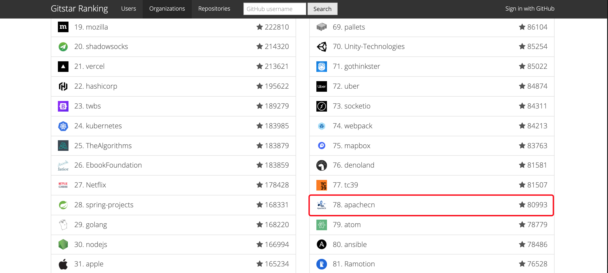

<h1 align="center">iBooker 布客</h1>
<p align="center">布道·开源·智能·极客</p>

---


<!--announce-->

## **公告**

1.  我们重启了简历付费优化业务，请咨询飞龙（🐧562826179，🛰wizardforcel）。
1.  本社区所有成员的个人行为均代表整个社区。无论你走到哪里，布客都是你的强大后盾！
1.  我们始终与所有创作者站在一起，为创作自由而战。我们还会提供一切必要的技术支持。
1.  我们社区没有整理 k12 课件的任何计划，因为我们拒绝为应试教育添砖加瓦。
1.  请各位（尤其是培训班）不要妄图干扰我们的公益活动，否则我们将会使用可以动用的任何手段（包括户籍出道、舆论压制、线下制裁、玄学诅咒）给予还击！

<!--endannounce-->

## 目标

1.  新型工作方式和生产关系
    1.  远程办公
    2.  量化交易策略
    3.  数字货币的构建和挖掘
2.  打通各个封闭系统，实现生态互联
    1.  模拟器或加载器等应用适配技术
    2.  网站和APP自动化操作，以及宣传引流技术
3.  研发和普及零边际成本技术，促进传统行业的数字化改造
    1.  用于文创的 3D 打印技术
    1.  光伏设备
    1.  其它零边际成本技术（例如AI创作）
4.  普及现代社会的必要知识，和极客的生活方式及理念
    1.  两性关系的破解
    1.  全自动化的生活方式
5.  努力打造创作自由、创作者友好的环境
    1.  软件逆向，密码学，隐写

ApacheCN（负责翻译和生态）五步走规划：

1.  作品数量和轻国相当
1.  镜像数量和笔趣阁相当
1.  翻译完 Github 上所有教程，并入某个去中心化系统
1.  整合和利用论文这样的稀疏知识来源，打造知识公链
1.  培养众多新型、可持续的开源社区

## 八大原则

+   性价比：在不牺牲体验的情况下，选择最便宜的，就是性价比。允许花时间省钱，只要省下来的钱按照市价高于时薪就能接受。

+   冗余：一、预估时间的时候，将极限时间x2就是最终时间（侯世达定律）。二、重要资料做好备份，本地至少两份在不同介质上。

+   标准化/流程化/自动化/智能化（IT 四化）：标准化是流程化的前提，流程化有助于外包，它是成功人士的唯一一个习惯。流程化也有助于自动化，即用机器解决问题。程序员的美德，就是能自动绝不手动。一个低级重复行为居然要手动，你好意思称自己是程序员嘛？

+   第一性原理：完成一个目标只有少数几个必要条件。只需要专注他们，不要总是有奇奇怪怪的无效假设。不要被乌合之众的观点/做法绑架。

+   热插拔：保证自己是个独立完整的系统，与别人合作但不依赖别人。优先磨练自己的议价能力而不是协作能力来增加选择面，保证自己可以随时中止合作关系，防止受限于任何人。遇到问题优先考虑终止合作并换人，而不是改善合作关系。

+   专注、迭代、极致：一次只专注于一件事情，允许不足，在多个迭代中反复改进，尽可能达到极致。

+   大数据：（1）大数据不仅仅指数字和表格本身，也包含情报，经验，教程，方法论这些非结构化数据。（2）收集数据来遍历每一种可能性，对抗不确定性，避免认知偏差，好处是无需亲身实践直接借助他人经验。（3）注意收集你暂时用不到，但是大家都需要的数据，并且改造你的存储设施来存的下更多数据。

+   跨界：用数字化改造一切，程序员的使命就是先消灭其它行业再消灭自身。

## 语录

> 渣男除了渣没其他缺点，舔狗除了舔没其他优点。
> 
> 既然我们做什么都会被喷，________________。
>
> 搞钱的大原则就是信息不对称
>
> 风口可能有很多个，但是对应的技术可能就那么点，所以，尽早储备一个通用的技术栈。
> 
> 资本家为了奴役你给你挖了很多坑，比如消费主义，比如训练你当螺丝钉，还有最重要的就是榨干你的空闲时间。
> 
> 打工的钱都是棺材费，自己从市场赚的才叫钱。尽早摆脱打工人的困境比啥都重要。
> 
> 一旦你的成本很低，时间就是你的朋友，否则就是你的敌人。这好比一颗树，只要根不死，总能活过来。
> 
> 在体验一样的情况下，选成本低的，但不要为此牺牲体验
> 
> 如果花在开源上的时间和刷牙洗脸一样，那么可持续性就不是问题。
>
> 宣传应当是你的产品的不可分割的一部分，它和内容同等重要，并且可以借助技术做得更好。五分内容五分宣传，这就是五五开定律。

<!--intro-->

## **组织介绍**

> 我们是布客（iBooker），一个大型开源社区、自媒体和网赚社区，旗下 QQ 群共一万余人，订阅用户至少一万人。Github Star 数量超过 60k 个，在所有 Github 组织中[排名前 100][top100]。旗下所有网站日 uip 超过 4k，[Alexa 排名的峰值为 20k][top20k]。我们的核心成员拥有[ CSDN 博客专家][csdn-pro]和[简书程序员优秀作者][js-pro]认证。我们建立了公益性文档和教程翻译项目 [ApacheCN][apachecn]。
> 
> 与商业组织不同，我们并不会追逐热点，或者唯利是图。作为公益组织，我们将完成项目放在首要位置，并有足够时间把项目打磨到极致。我们希望做出广大 AI 爱好者和个人开发者真正需要的东西，打造真正有价值的长尾作品。

[top100]: https://gitstar-ranking.com/apachecn
[top20k]: http://home.apachecn.org/img/about/alexa_201906.png
[csdn-pro]: https://blog.csdn.net/wizardforcel
[js-pro]: https://www.jianshu.com/u/b508a6aa98eb
[apachecn]: https://github.com/apachecn

* [主页：apachecn.org](http://apachecn.org)
* [导航：docs.apachecn.org](https://docs.apachecn.org/)
* [知识星球：iBooker 布客](https://t.zsxq.com/Jq3vZZB)
* [看云：@ApacheCN](https://www.kancloud.cn/@apachecn)
* [语雀：@ApacheCN](https://yuque.com/apachecn)
* 代码仓库
    * [Github：@ApacheCN](https://github.com/apachecn)
    * [Gitee：@ApacheCN](https://gitee.com/apachecn)
    * [CodeChina：@ApacheCN](https://codechina.csdn.net/apachecn)
* 自媒体平台
    * [微博：@ApacheCN](https://weibo.com/u/6326715527)
    * [知乎专栏：AILearning](https://zhuanlan.zhihu.com/apachecn-mlia)
    * [公众号：ApacheCN](http://home.apachecn.org/img/qr/apachecn_qr.jpg)
    * [CSDN][csdn]／[博客园][cnblogs]／[OSChina][osc]／[SF][sf]／[掘金][juejin]
    * [简书][jianshu]／[搜狐号][sohu-mp]／[头条号][toutiao-mp]／[bilibili][bili]
* **We are ApacheCN Open Source Organization, not ASF! We are fans of AI, and have no relationship with ASF!**
* 合作 or 侵权，请联系 <apachecn@163.com> | 请抄送一份到 <wizard.z@foxmail.com>

[csdn]: https://blog.csdn.net/wizardforcel/article/category/8437073
[cnblogs]: https://www.cnblogs.com/apachecn
[osc]: https://my.oschina.net/u/1777350?tab=newest&catalogId=6512710
[sf]: https://segmentfault.com/blog/flygon
[juejin]: https://juejin.im/user/57960af3128fe10056c637e4/posts
[jianshu]: https://www.jianshu.com/c/4ee721d0c474
[sohu-mp]: https://mp.sohu.com/profile?xpt=NDhjYmViMzMtZWE2Yi00NTlmLWE3OTQtY2FjNjIwNDBlZDJl
[toutiao-mp]: https://www.toutiao.com/c/user/3901644178/
[bili]: http://space.bilibili.com/97678687


<!--endintro-->

## **交流方式**

> 客服人员

- QQ: 529815144
- 【推荐: 建议加QQ，再邀请微信群 - 目前已经封了2个微信群】

| 时间 | 群人数  | 群名称  | 群号  | 
| --- | --- | --- | --- |
| 2021-05-19 | 1000 | 1062944139 | 读书会-财富自由群 |
| 2020-11-02 | 1000 | 1049896590 | 券商开户免5群 |
| 2022-10-23 | 2000 | 979932878  | 【羊村】备胎计划群 |
| 2017-09-01 | 2000 | 915394271  | 【羊村】职场装逼群 3 | 
| 2019-09-17 | 1000 | 713436582  | PyTorch 中文翻译组 | 
| 2018-05-02 | 2000 | 152622464  | 大数据-2 | 
| 2014-04-12 | 2000 | 214293307  | 大数据-1 | 
|  |  |  |  |
| 2018-02-07 | 3000 | ~~724187166~~  | 2.面试求职(2022-10-23 封) | 
| 2017-09-01 | 3000 | ~~629470233~~  | 1.机器学习(2020-01-03 封) | 

组织口号: <strong><span style="color: #ff0000;">不装逼的朋友，我们都不想认识 。。</span></strong>

## **协议**

以各项目协议为准。

ApacheCN 账号下没有协议的项目，一律视为 [CC BY-NC-SA 4.0](https://creativecommons.org/licenses/by-nc-sa/4.0/deed.zh)。

霞鹜文楷采用 [SIL 开放字体协议 1.1](https://github.com/lxgw/LxgwWenKai/blob/main/SIL_Open_Font_License_1.1.txt)。

## **捐赠列表**

* 捐赠名单: [捐赠名单.html](/docs/donate/README.md)
* 捐赠方式: 请直接扫描绿帽二维码(微信和支付宝都行)


## GitHub Star Rank

> 全球组织排名



> 组织内部排名


## **鸣谢**

| | | |
| --- | --- | --- |
|  |  |  | 
| [Datawhale][datawhale] | [AI 有道][aiyoudao] | [AIStart][huanghaiguang] | 
|  |  |  |
| [PythonChina][pycn] | [苍海国际][258ch] | [黑客派/B3log][hacpai] |
|  | |  |
| [GirlsInAI][gia] | [DataSciComp][datascicomp] | [SeanCheney][seancheney] |
|   |  |  |
|  [AI 科技大本营][aikeji] | [Hsury/BiliDrive][bdrive] | [FlyAI][flyai] |
|  |  |  |
| [Tesra][tesra] | [Zlibrary][zlib] | [Skypool][skypool] |
|  |  |  |
| [OI Wiki][oiwiki] | [小宇学长][langji] | [丁鹏][dingpeng] |
|  |  |  |
| [润学][run] | [城市猎人][chengshilieren] | [剽悍生活][piaohanshenghuo] |

[datawhale]: http://home.apachecn.org/img/qr/datawhale_qr.jpg
[aiyoudao]: http://home.apachecn.org/img/qr/redstone_qr.jpg
[huanghaiguang]: http://home.apachecn.org/img/qr/huanghaiguang_qr.jpg
[pycn]: https://github.com/pycn
[258ch]: https://www.258ch.com/
[hacpai]: https://hacpai.com/
[gia]: https://www.weibo.com/u/2650740963
[datascicomp]: https://iphysresearch.github.io/DataSciComp/
[seancheney]: https://www.jianshu.com/u/130f76596b02
[aikeji]: https://blog.csdn.net/dQCFKyQDXYm3F8rB0
[bdrive]: https://github.com/Hsury/BiliDrive
[flyai]: https://www.flyai.com/
[tesra]: https://www.tesra.org/
[zlib]: https://b-ok.org
[skypool]: https://skypool.org
[oiwiki]: https://oi-wiki.org/
[langji]: https://weibo.com/u/7354625866
[dingpeng]: https://s.weibo.com/weibo?q=%23%E7%9F%A5%E5%90%8D%E9%87%8F%E5%8C%96%E6%8A%95%E8%B5%84%E4%BA%BA%E6%95%99%E8%82%B2%E5%84%BF%E5%AD%90%E8%A6%81%E6%B8%A3%E4%B8%80%E7%82%B9%23
[run]: https://github.com/The-Run-Philosophy-Organization/run
[chengshilieren]: https://www.zhihu.com/people/cheng-shi-xi-ren-6
[piaohanshenghuo]: https://piaohanshenghuo.com/

## **友情链接**

| 网站名称 | 网站地址  |
| --- | --- |
| 龙哥盟   | https://flygon.net |
| 极度空间 | http://likedge.top |
| 阿中哥   | http://codefun007.xyz |
| AIHub   | https://www.kuxai.com |
| PyMiner | http://www.py2cn.com |
| lzhpo | http://www.liuzhaopo.top |
| Jaybo | https://strivebo.com |
| 跑跑后花园 | https://bbs.popkart.org/ |

## 下载编译

**选择其中任意一种方式就行！**

```
## 方式1: Docker ##
docker pull apachecn0/apachecn-home
docker run -tid -p <port>:80 apachecn0/apachecn-home
# 访问 http://localhost:{port} 查看文档

## 方式2: PYPI ##
pip install apachecn-home
apachecn-home <port>
# 访问 http://localhost:{port} 查看文档

## 方式3: NPM ##
npm install -g apachecn-home
apachecn-home <port>
# 访问 http://localhost:{port} 查看文档
```
