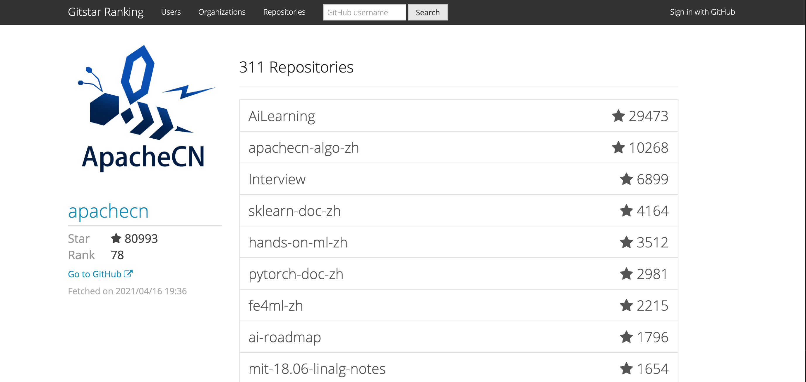

<h1 align="center">iBooker 布客</h1>

布道·开源·智能·极客

---

## **组织介绍**

> 我们是布客（iBooker），一个大型开源社区、自媒体和网赚社区，旗下 QQ 群共一万余人，订阅用户至少一万人。Github Star 数量超过 60k 个，在所有 Github 组织中[排名前 100][top100]。旗下所有网站日 uip 超过 4k，[Alexa 排名的峰值为 20k][top20k]。我们的核心成员拥有[ CSDN 博客专家][csdn-pro]和[简书程序员优秀作者][js-pro]认证。我们建立了公益性文档和教程翻译项目 [ApacheCN][apachecn]。
> 
> 与商业组织不同，我们并不会追逐热点，或者唯利是图。作为公益组织，我们将完成项目放在首要位置，并有足够时间把项目打磨到极致。我们希望做出广大 AI 爱好者和个人开发者真正需要的东西，打造真正有价值的长尾作品。

[top100]: https://gitstar-ranking.com/apachecn
[top20k]: http://www.apachecn.org/img/about/alexa_201906.png
[csdn-pro]: https://blog.csdn.net/wizardforcel
[js-pro]: https://www.jianshu.com/u/b508a6aa98eb
[apachecn]: https://github.com/apachecn

* [主页：apachecn.org](http://apachecn.org)
* [导航：docs.apachecn.org](https://docs.apachecn.org/)
* [知识星球：iBooker 布客](https://t.zsxq.com/Jq3vZZB)
* [看云：@ApacheCN](https://www.kancloud.cn/@apachecn)
* [语雀：@ApacheCN](https://yuque.com/apachecn)
* 代码仓库
    * [Github：@ApacheCN](https://github.com/apachecn)
    * [Gitee：@ApacheCN](https://gitee.com/apachecn)
    * [CodeChina：@ApacheCN](https://codechina.csdn.net/apachecn)
* 自媒体平台
    * [微博：@ApacheCN](https://weibo.com/u/6326715527)
    * [知乎专栏：AILearning](https://zhuanlan.zhihu.com/apachecn-mlia)
    * [公众号：ApacheCN](http://data.apachecn.org/img/contact/weixin.png)
    * [CSDN][csdn]／[博客园][cnblogs]／[OSChina][osc]／[SF][sf]／[掘金][juejin]
    * [简书][jianshu]／[搜狐号][sohu-mp]／[头条号][toutiao-mp]／[bilibili][bili]
* **We are ApacheCN Open Source Organization, not ASF! We are fans of AI, and have no relationship with ASF!**
* 合作 or 侵权，请联系 <apachecn@163.com>

[csdn]: https://blog.csdn.net/wizardforcel/article/category/8437073
[cnblogs]: https://www.cnblogs.com/apachecn
[osc]: https://my.oschina.net/u/1777350?tab=newest&catalogId=6512710
[sf]: https://segmentfault.com/blog/flygon
[juejin]: https://juejin.im/user/57960af3128fe10056c637e4/posts
[jianshu]: https://www.jianshu.com/c/4ee721d0c474
[sohu-mp]: https://mp.sohu.com/profile?xpt=NDhjYmViMzMtZWE2Yi00NTlmLWE3OTQtY2FjNjIwNDBlZDJl
[toutiao-mp]: https://www.toutiao.com/c/user/3901644178/
[bili]: http://space.bilibili.com/97678687

<!--endintro-->

## **交流方式**

> 客服人员

- 微信/QQ: 529815144 【片刻】
- 【推荐: 建议加QQ，再邀请微信群（包括: 财务微信群、正经微信群、不正经微信群） - 目前已经封了8个微信群】
- 其中为了防止被封，有TG群: <https://t.me/dafeiyang> 【本群不维护，封群后提供新QQ群的位置】
- 【欢迎白嫖】羊村 ChatGPT (没套路，无需注册，免费使用，建议用Chrome浏览器): <https://ailake.top/chat>

| 时间 | 群人数  | 群名称  | 群号  |
| --- | --- | --- | --- |
| 2023-05-01 | 500  | 529815144（微信） | 可加 ChatGPT(1和2群) 免费白嫖 |
| 2021-05-19 | 1000 | 1062944139 | 财富书籍交流群（读书会、万1免5开户） |
| 2020-11-02 | 1000 | 1049896590 | 财富资料备份群（备份群） |
| 2022-10-23 | 2000 | 979932878  | 【羊村】职场备份群（仅做3群备份） |
| 2017-09-01 | 2000 | 915394271  | 【羊村】职场装逼群 3 | 
| 2019-09-17 | 1000 | 713436582  | 中文翻译组 | 
| 2018-05-02 | 2000 | 152622464  | 大数据-2 | 
| 2014-04-12 | 2000 | 214293307  | 大数据-1 | 
|  |  |  |  |
| 2023-01-01 | 500  | ~~723515071~~  | 玄学、两性交流 |
| 2018-02-07 | 3000 | ~~724187166~~  | 2.面试求职(2022-10-23 封) | 
| 2017-09-01 | 3000 | ~~629470233~~  | 1.机器学习(2020-01-03 封) | 

组织口号: <strong>不装逼的朋友，我们都不想认识 。。</strong>

## **协议**

以各项目协议为准。

ApacheCN 账号下没有协议的项目，一律视为 [CC BY-NC-SA 4.0](https://creativecommons.org/licenses/by-nc-sa/4.0/deed.zh)。

霞鹜文楷采用 [SIL 开放字体协议 1.1](https://github.com/lxgw/LxgwWenKai/blob/main/SIL_Open_Font_License_1.1.txt)。

## **捐赠列表**

* 捐赠名单: [捐赠名单.html](/docs/donate/README.md)
* 捐赠方式: 请直接扫描绿帽二维码(微信和支付宝都行)

## GitHub Star Rank

> 全球组织排名

> 组织内部排名

## **鸣谢**

| | | |
| --- | --- | --- |
|  |  |  | 
| [Datawhale][datawhale] | [AI 有道][aiyoudao] | [AIStart][huanghaiguang] | 
|  |  |  |
| [PythonChina][pycn] | [苍海国际][258ch] | [黑客派/B3log][hacpai] |
|  | |  |
| [GirlsInAI][gia] | [DataSciComp][datascicomp] | [SeanCheney][seancheney] |
|   |  |  |
|  [AI 科技大本营][aikeji] | [Hsury/BiliDrive][bdrive] | [FlyAI][flyai] |
|  |  |  |
| [Tesra][tesra] | [Zlibrary][zlib] | [Skypool][skypool] |
|  |  |  |
| [OI Wiki][oiwiki] | [小宇学长][langji] | [丁鹏][dingpeng] |
|  |  |  |
| [润学][run] | [城市猎人][chengshilieren] | [剽悍生活][piaohanshenghuo] |

[datawhale]: http://www.apachecn.org/img/qr/datawhale_qr.jpg
[aiyoudao]: http://www.apachecn.org/img/qr/redstone_qr.jpg
[huanghaiguang]: http://www.apachecn.org/img/qr/huanghaiguang_qr.jpg
[pycn]: https://github.com/pycn
[258ch]: https://www.258ch.com/
[hacpai]: https://hacpai.com/
[gia]: https://www.weibo.com/u/2650740963
[datascicomp]: https://iphysresearch.github.io/DataSciComp/
[seancheney]: https://www.jianshu.com/u/130f76596b02
[aikeji]: https://blog.csdn.net/dQCFKyQDXYm3F8rB0
[bdrive]: https://github.com/Hsury/BiliDrive
[flyai]: https://www.flyai.com/
[tesra]: https://www.tesra.org/
[zlib]: https://b-ok.org
[skypool]: https://skypool.org
[oiwiki]: https://oi-wiki.org/
[langji]: https://weibo.com/u/7354625866
[dingpeng]: https://s.weibo.com/weibo?q=%23%E7%9F%A5%E5%90%8D%E9%87%8F%E5%8C%96%E6%8A%95%E8%B5%84%E4%BA%BA%E6%95%99%E8%82%B2%E5%84%BF%E5%AD%90%E8%A6%81%E6%B8%A3%E4%B8%80%E7%82%B9%23
[run]: https://github.com/The-Run-Philosophy-Organization/run
[chengshilieren]: https://www.zhihu.com/people/cheng-shi-xi-ren-6
[piaohanshenghuo]: https://piaohanshenghuo.com/

## **友情链接**

| 网站名称 | 网站地址  |
| --- | --- |
| 龙哥盟   | https://flygon.net |
| 极度空间 | http://likedge.top |
| 阿中哥   | http://codefun007.xyz |
| AIHub   | https://www.kuxai.com |
| PyMiner | http://www.py2cn.com |
| lzhpo | http://www.liuzhaopo.top |
| Jaybo | https://strivebo.com |
| 跑跑后花园 | https://bbs.popkart.org/ |
