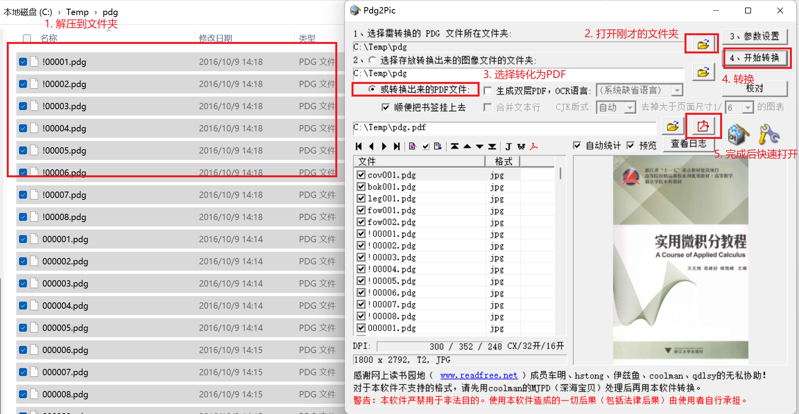

# 超星图书馆图书下载教程

1.  [（可选）了解秒传代码是什么](https://home.apachecn.org/#/docs/miaochuan)
1.  [安装油猴插件](https://www.tampermonkey.net/)
1.  [安装秒传脚本](https://greasyfork.org/zh-CN/scripts/424574)
1.  [安装文献互助脚本](https://greasyfork.org/zh-CN/scripts/435569)
1.  [在超星图书馆中搜索你想下载的图书](http://www.ucdrs.superlib.net/)，复制其 SSID
1.  访问超星书籍检索工具，例如 [ssdown](https://beta.ssdown.org/) 或者 [freembook](https://freembook.com/)，把 SSID 粘贴到搜索框中点击【搜索】按钮
1.  在搜索结果页面中复制秒传代码
1.  [打开百度网盘](https://pan.baidu.com/)，点击上方的【秒传】按钮，在输入框中输入秒传代码，之后点击【确定】按钮
    
    
1.  从百度网盘下载保存的文件
1.  如果格式是压缩包或者 UVZ，将其解压，[使用这个工具将其中的 PDG 合成为 PDF](https://pan.ssdown.org/Pdg2Pic.zip)

    